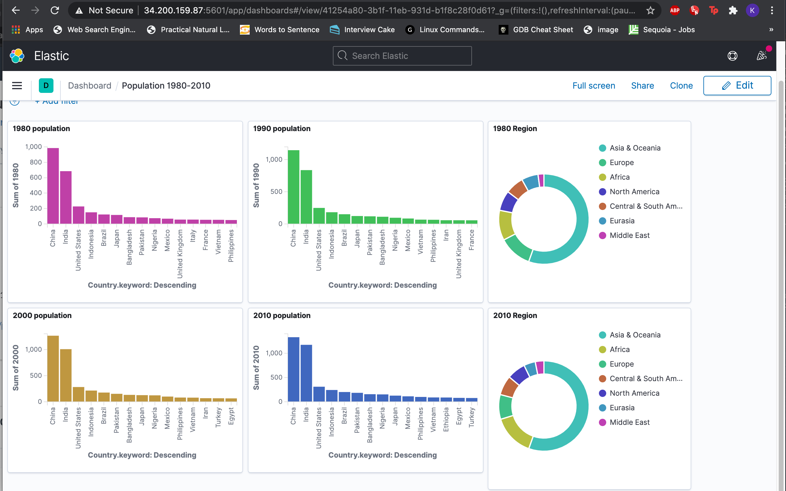

# In Depth Study

### 1. ELK stack

- Creating stack

Use EC2 ubuntu instance. Type : m4.large 
Associate Elastic IPs with the instance
Use 0.0.0.0 as a host name
Installing procedures are followed by this website (https://logz.io/learn/complete-guide-elk-stack/#installing-elk)

- Logstash
Use population by country 1980 - 2010 data. 
Download link : https://data.world/doe/population-bycountry-1980-2010

- Visualization
Bar Chart : Compare the 1980 / 1990 / 2000 / 2010 Top10 Population Country
Pie Chart : Compare the distribution of population in regions

### 2. Kafka and Spark Setup

- Test sample example in AWS
Use EMR cluster
Create S3 bucket and stores sample dataset and sample code
Dataset : 2016-stack-overflow-survey-responses.csv
Code : StackOverFlowSurvery.py
Sample : Check the dogs_vs_cats and job_satisfaction only. By using withcolumn, floor the count value

 
### 3. Final Data Pipeline: Credit Card fraud detection and billing

#### (1) Basic Pipeline : 
- Create transaction Data every seconds and produce a message into Topic1 (create 1000 messages in total)
- Topic1 trigger the lambda function
- Lambda check if the transaction is fraud or not
- Lambda create details of transaction and produce a message into Topic2
- Spark Streaming the Topic2
- After it finishes sending messages, store the Topic2 data, and upload it into S3 bucket.
- Using the AWS QuickSight, visualize the processed data.

#### (2) User’s transaction data created every second. 
Basically, it assigns value in user id, location id, and price, then creates a message. It would send 1000 messages in total, and in every second, it would produce the message to topic 1. 

##### Sample Message :
{‘userid’ : 1, ‘locid’ : 29, ‘price’ : 5300}
 
#### (3) By using MSK, the topic1 would trigger the lambda function, called kafkatest

First, it checks if the transaction is valid. First assumption I made is that, if the userid is 1, then his/her location id is the same as 1. Thus, if the gap between the userid and locid is more than 80, this means it is too far away from his/her place, so decline the transaction. Also, if the price of purchase is more than 10000, then it also rejects that transaction. 

After a decline or approval of a transaction, it would create a message that contains ‘approval status’, ‘userid’, ‘locid’, ‘price’, ‘amount’, ‘item’, and ‘timestamp’. At this point, I also assumed that this lambda would also work as a Point of sale sending the details of the purchase. It would randomly choose the value from the list. For example, a random item will be chosen from the item_list, which contains ‘food’, ‘toy’, ‘stationery’, ‘health’, ‘service’, ‘art’, and ‘transportation’. After getting all required items, then complete the message. At last, it would produce this message to Topic2.

#### (4) Spark streaming that showed the on-going process on Topic2.
##### Sample Recording :
https://drive.google.com/file/d/13YDYJO1Ks_aKApLh0Po9RUKMEadyhakY/view?usp=sharing

- First, run the code in part1. It would automatically produce data into Topic1 every second.
- Then, run the code above. It would stream the update of the Topic2.
 
#### (5) Editing the dataset, and visualization

After all the messages were created (1000 messages), I saved the log file into the s3 bucket. By using the AWS Quicksight, I created a static dashboard that shows the sum of price by user, ratio of rejection and approval of transactions, sum of price by location, and user’s average location (which might show the activity range of people).  

